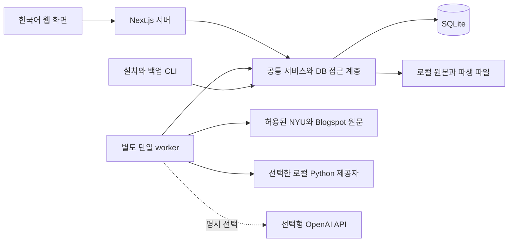
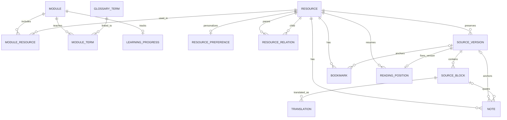
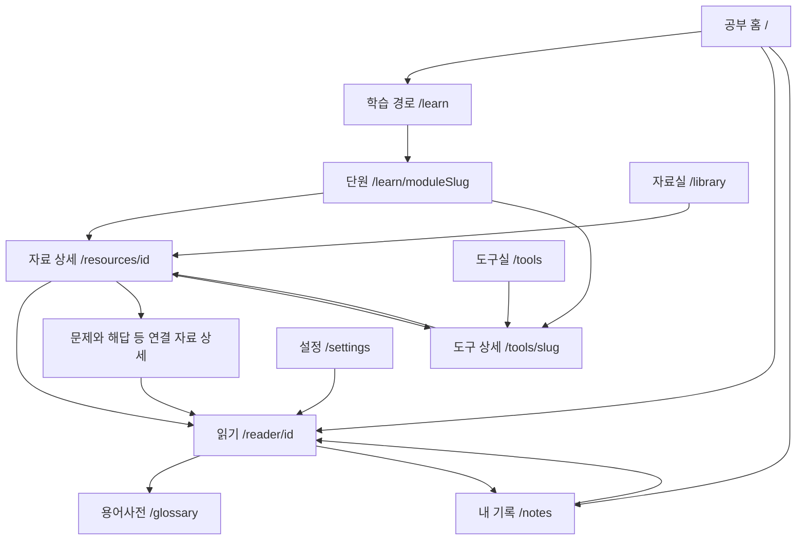

# 달모다란 (MoonModaran) — DB 관리와 페이지 관계 설계

작성일: 2026-09-09 · 버전: 1.4 · 상태: 실제 모델 가중치 미세조정 추가 승인 반영

이 문서는 [제품 요구사항](DAMODARAN_KO_LEARNING_SPEC.md)의 P0를 DB·파일·페이지·작업 처리 구조로 구체화한다. 앱 코드·DB·실행 명령이 구현되어 있으며 실제 검증 결과와 외부 제약은 [구현 상태](IMPLEMENTATION_STATUS.md)에 별도로 기록한다. 아래 내용은 구현을 유지·변경할 때 참고하는 계약이다.

문서 역할은 제품 요구사항에 ‘무엇을 만드는지’, 이 문서에 ‘데이터를 어떻게 보관하고 화면을 연결하는지’, [AGENTS.md](AGENTS.md)에 ‘개발할 때 지킬 절차’를 두는 것이다. 제품 범위는 기존 요구사항을 따르고, 이 문서에서 정한 구현 세부를 바꾸면 이유와 영향도 함께 갱신한다.

초기 설치에서 설정을 생략한 번역 기본값은 `TRANSLATION_PROVIDER=argos`다. 무료 공개 도구 Argos Translate의 로컬 영어→한국어 모델 1.1을 사용하며, `openai`를 명시적으로 선택한 경우만 키·모델과 외부 API를 사용한다. 기존 DB·원문·메모·번역은 보존한다. 새 제공자의 설치·성능·실제 번역 검증 결과는 구현 상태 문서에서 별도로 확인한다.

추가 승인된 실제 모델 미세조정은 8.4절의 별도 로컬 CLI 작업이다. 금융 용어 사후 보정이나 검수 번역 메모리로 대체하지 않으며, 학습·평가·앱 적용을 각각 구분한다. 이 PC는 별도 Q26 비교·격리 앱 검증 후 `hymt`를 명시 선택했으며 운영 HTML 3문단의 생성·저장·캐시와 최종 API의 실제 검증 완료를 확인했다. 운영 metadata 범위는 `html-only`이며 격리 PDF QA와 구분한다.

## 1. DB는 누가, 어떻게 관리하는가

사용자는 앱에서 메모·진도·북마크를 저장한다. 앱 서버와 작업 프로세스가 공통 데이터 계층을 통해 SQLite를 관리한다. 일상적인 사용에 SQL 실행이나 별도 DB 서버 설치는 필요하지 않도록 구현한다.

| 구분 | 저장 위치 | 관리 방식 |
|---|---|---|
| 자료 목록·단원·용어 | `data/library.sqlite` | 버전 관리하는 seed를 최초 등록, 다시 실행해도 중복 방지 |
| 원문 문단·번역·메모·진도·읽기 위치 | 같은 SQLite DB | 앱/API에서 읽고 저장, 재시작 후 유지 |
| 가져오기·번역 작업과 사용량 | 같은 SQLite DB | 별도 worker가 작업을 처리하고 실제 결과 기록 |
| HTML·PDF·Excel 원본 | `data/originals/` | 원본 바이트를 보존하고 DB에 경로·해시 기록 |
| 본문 이미지·PDF 추출 보조 파일 | `data/derived/` | 원문 버전과 연결, 오프라인 읽기에 필요한 파일 보존 |
| 개인 백업 | `data/backups/` | DB 스냅샷과 그 DB가 참조하는 파일을 한 묶음으로 저장 |
| 선택형 OpenAI API 키 | 앱 루트의 `.env.local` | `openai` 명시 선택 때만 서버에서 사용. DB·브라우저·백업에 저장하지 않음 |
| 로컬 번역 환경·모델 | `.venv-translation/`, `.translation/` | `setup:translation`으로 설치. Git·public·개인 데이터 백업 제외, 재설치 가능 |
| 모델 학습 환경 | `.venv-training/` | `setup:training`으로 설치하는 별도 Python 환경. Git·public·DB 백업 제외 |
| 기반 모델·개인 학습 결과 | `.training/` | 고정 모델·실행별 가중치·optimizer·체크포인트·평가 기록. DB 백업 제외, 개인 파생 결과 별도 보관 |
| 초기 모델 학습·평가 데이터 | `content/training/` | 도우미 작성 문장과 출처·분할·해시를 Git으로 관리. 사용자 검수 내보내기와 구분 |
| 스키마 변경 이력·초기 콘텐츠 | `lib/db/migrations/`, `content/` | 코드와 함께 Git으로 관리 |

`DATA_DIR` 기본값은 앱 루트 기준 `./data`다. 절대 경로 설정도 허용한다. 웹·worker·설치·가져오기·백업 명령은 공통 환경 로더를 사용하여 같은 절대 경로를 해석한다. 실행한 터미널의 위치 때문에 서로 다른 DB가 생기면 안 된다.

DB의 `original_path`, `local_path`와 백업 manifest 안의 파일 경로는 모두 **DATA_DIR 기준 상대 경로**로 저장한다. 파일 접근 시 현재 DATA_DIR에 결합하고 실제 경로가 그 아래에 있는지 검증한다. 따라서 백업을 다른 폴더에 복원해도 이전 폴더의 절대 경로를 참조하지 않는다.

운영 DB는 로컬 디스크에 둔다. 실행 중인 DB를 네트워크 공유나 파일 동기화 대상으로 사용하지 않는다. 별도 디스크에 보관하려면 완성된 백업 묶음을 복사한다. `data/`, `.env.local`은 Git과 `public/`에서 제외한다.

## 2. 실행 구조와 코드 책임

| 코드 영역 | 책임 | 경계 |
|---|---|---|
| `app/`, `components/` | 화면, 사용자 입력, 접근성, 페이지 단위 상태 | 브라우저에서 DB·파일 시스템·비밀키 직접 접근 금지 |
| `app/api/` | 입력·Origin/Host 검증, 조회·저장, 작업 등록 | 긴 다운로드·추출·번역을 HTTP 요청 안에서 끝내지 않음 |
| `lib/db/` | 스키마, 마이그레이션, 연결, 트랜잭션, 조회 함수 | 화면마다 별도 DB 로직을 만들지 않음 |
| `lib/sources/`, `lib/extraction/` | 원문 주소 검증, 다운로드, 형식 확인, 본문 구조 추출 | 원문 HTML 스크립트·Excel 매크로를 실행하지 않음 |
| `lib/translation/`, `lib/service.ts` | 번역 제공자, 캐시, 보호 토큰·응답 검사, 관련 용어 선택·조회 | 원문·번역·해설을 별도 콘텐츠로 취급 |
| `lib/jobs/`, `worker/` | 작업 등록·claim·heartbeat·재시도·취소·진행 집계 | 페이지 렌더링이나 hot reload에서 worker 생성 금지 |
| `scripts/`의 앱 CLI | setup, seed, 초기 가져오기, 번역 검증, 백업 | 웹과 동일한 설정·스키마·파일 규칙 사용 |
| `scripts/model-training/`, `scripts/train-model.ts` | 격리 학습 환경 설치, 실제 가중치 학습, dev/test 평가, 조건부 모델 변환 | 운영 DB·앱 작업 큐를 사용하지 않는 별도 로컬 실행. 실험 ID와 모델·데이터·설정 해시로 재현성 관리 |

Argos는 worker가 Python 하위 프로세스를 시작하고 NDJSON 요청·결과를 주고받는 방식이다. 별도 HTTP 서버·외부 무료 번역 중계에 의존하지 않는다. 설치 시 공식 패키지와 모델을 내려받으며, 설치를 마친 로컬 번역은 원문을 PC 밖으로 보내지 않는다. Python 런타임·패키지와 모델은 설치 정보를 기록하고 실제 파일 해시·런타임 식별값으로 구분한다. 모델 파일 외 Python 의존성도 설치되므로 모델 용량을 전체 설치 용량으로 안내하지 않는다.

서버 컴포넌트는 내부 서비스를 직접 호출해도 된다. 내부 조회를 위해 자기 HTTP API를 다시 호출할 필요는 없다. 클라이언트의 저장 동작과 worker는 같은 서비스 검증을 거친다. 저장 성공 후 홈·자료실·내 기록에서 변경 결과가 보이도록 관련 조회를 갱신한다.

## 3. DB 연결·마이그레이션·초기화

### 3.1 SQLite 연결 정책

초기 후보는 Drizzle과 호환되는 SQLite 드라이버였다. 구현은 `better-sqlite3` 13.0.3과 명시적 SQL 마이그레이션·파라미터 바인딩을 선택했다. 복합 외래키·lease 트랜잭션·네이티브 백업을 같은 계층에서 관리하고 중복 ORM 정의를 피하기 위한 결정이다. 실제 Windows 설치·테스트를 확인하고 lockfile에 고정했으며 SQLite 런타임은 3.53.4다.

| 설정 | 설계 기본값 | 이유 |
|---|---|---|
| `journal_mode` | `WAL` | 웹 조회와 worker 저장이 함께 일어나는 구조 지원 |
| `foreign_keys` | 모든 연결에서 `ON` | 없는 자료·버전에 대한 참조 방지 |
| `busy_timeout` | 모든 연결에서 5,000ms | 짧은 쓰기 경합 대기. 초과하면 명시적인 재시도 가능 오류 |
| `synchronous` | 모든 연결에서 `FULL` | 개인 메모와 번역 결과의 내구성을 우선하는 초기 결정 |

WAL에서도 쓰기는 직렬화된다. 네트워크 요청을 기다리는 동안 DB 쓰기 트랜잭션을 잡지 않고, 작업 claim과 결과 저장에 짧은 트랜잭션을 사용한다. 외래키는 연결마다 활성화한다. [SQLite WAL](https://www.sqlite.org/wal.html), [외래키 설정](https://www.sqlite.org/foreignkeys.html)에 근거한다.

실제 설치 시 드라이버가 사용하는 SQLite 런타임의 `sqlite_version()`을 확인한다. WAL-reset 수정이 포함된 릴리스(3.51.3 이상 또는 공식 백포트)를 사용한다. 패키지 버전만으로 내장 SQLite 버전을 추정하지 않는다. [SQLite의 수정 안내](https://www.sqlite.org/wal.html).

### 3.2 스키마 변경

1. 스키마 변경은 SQL 마이그레이션과 관련 서비스 타입에 함께 기록한다. 적용 이력에는 번호·체크섬·적용일을 남긴다. 현재는 ORM 대신 SQL 마이그레이션이 스키마의 기준이다.
2. `setup`은 동시 실행을 막는 설치 잠금 아래에서 미적용 마이그레이션을 순서대로 적용한다. 웹·worker는 스키마를 임의로 변경하지 않는다.
3. 기존 DB를 바꾸기 전에 백업한다. 변경 중에는 웹·worker를 정상 종료한다. 가능한 변경은 트랜잭션으로 처리하고 실패한 마이그레이션을 적용 완료로 기록하지 않는다.
4. 적용한 마이그레이션을 수정하지 않는다. 수정이 필요하면 다음 마이그레이션을 추가한다. 운영 DB 초기화나 테이블 재생성으로 변경을 대신하지 않는다.
5. 앱보다 새로운 스키마이거나 필수 마이그레이션이 없으면 시작 시 원인을 안내한다. 손실을 감수하는 자동 다운그레이드는 하지 않는다.

### 3.3 seed와 개인 변경의 분리

- 자료 `R01~R20`, `B01~B06`, `T01~T10`, 모듈 `M01~M08`, 용어 40개 이상의 ID를 고정한다.
- 신규 목록은 insert, 편집 콘텐츠 변경은 명시적으로 허용한 필드만 update한다. 사용자 업로드·메모·북마크·진도·번역을 건드리지 않는다.
- 자료의 기본 우선순위는 `resources`에, 사용자가 바꾼 우선순위는 `resource_preferences`에 둔다. 화면에는 사용자 값이 있으면 우선 적용한다.
- 용어 수정은 `revision`을 올린다. 기존 번역은 보존하고 적용 용어집이 달라진 경우 상태만 구분한다.
- 최초 seed는 네트워크와 독립적으로 실행한다. 최초 실제 가져오기는 R01·R02·R05와 확인된 PDF 1개뿐이다. 목록 36개 등록은 전체 파일 수집·번역을 의미하지 않는다.

## 4. 데이터 모델과 관계

테이블명은 아래 snake_case, API 필드명은 camelCase를 사용한다. 시간은 UTC로 저장하고 화면에서 현지 시간으로 표시한다. 원문 발행일·HTTP 수정일·가져온 날짜는 별개이며 모르는 값은 null로 둔다.

### 4.1 자료·학습 콘텐츠

| 테이블 | 핵심 필드 | 관계·제약 |
|---|---|---|
| `resources` | id, source_type, canonical_url, original_filename, author, title_en/ko, summary_ko, kind, format, level, priority, tags_json, source_status | 원격 자료는 URL 필수. 업로드는 URL nullable. 목록·본문·파일 구분 |
| `resource_preferences` | resource_id, priority_override, updated_at | 자료당 최대 1개. seed와 분리한 사용자 설정 |
| `resource_relations` | parent_id, child_id, relation, order | 자료 사이 attachment/solution/reading/tool/alternate. 동일 조합 중복·자기참조 금지 |
| `modules` | id, slug, order, title_ko, objectives_json, questions_json | slug unique. 확인 질문에는 ‘학습실 작성’ 출처 유형 포함 |
| `module_resources` | module_id, resource_id, role, order, optional_range_json | 단원과 자료의 다대다 연결. 확인된 읽기 범위만 기록 |
| `glossary_terms` | id, term_en, acronym, term_ko, aliases_json, definition_ko, formula, example_ko, notes, sources_json, revision | 검색 별칭과 문맥 주의 포함. 정의·예시의 출처 구분 |
| `module_terms` | module_id, term_id, role, order | 단원별 선수 용어·핵심 용어 연결 |
| `editorial_contents` | id, resource_id, source_version_id?, block_id?, type, text_ko, provenance, references_json | 학습 해설·편집자 주. 원문 번역 테이블과 분리 |

Excel 가이드는 `content/tool-guides/`에서 T01~T10의 resource ID 및 고정 slug로 연결한다. 도구실과 자료실에서 같은 Excel 자료를 조회하며 별도 복사본을 만들지 않는다. 웹 가이드 내용은 버전 관리하고 파일 내부를 확인하지 않은 시트명·셀 주소는 쓰지 않는다.

### 4.2 원문·번역

| 테이블 | 핵심 필드 | 관계·제약 |
|---|---|---|
| `source_versions` | id, resource_id, file_hash, original_path, final_url, mime, byte_size, page_count?, imported_at, fetched_at, published_at?, http_last_modified?, etag?, declared_version?, extractor_version, extraction_config_hash, extraction_status | 하나의 자료에 여러 원문/추출 버전. 같은 자료·파일 해시·추출기·추출 설정 조합은 unique |
| `source_blocks` | id, source_version_id, order, type, text, source_hash, page_index?, bbox_json?, structure_json?, warnings_json | 한 버전의 제목·문단·표·이미지 참조. 버전 내 순서 unique |
| `source_assets` | id, source_version_id, source_url?, local_path?, file_hash?, mime?, status | 본문 도표·이미지 및 필요한 파생 파일. 가져오기 실패도 표현 |
| `translations` | id, block_id, cache_key, text_ko, provider, model, prompt_version, glossary_version, context_hash, generation_status, validation_status, review_status, usage_json, created_at | 원문 블록당 여러 설정의 결과. cache_key unique. 원문과 문맥이 같은 결과만 재사용 |
| `translation_reviews` | id, translation_id, parent_review_id, source_text, source_hash, context_hash, glossary_version, block_type, text_ko, created_at | 사용자가 저장한 검수 이력. 기존 기계 번역·이전 검수본 보존 |
| `translation_review_links` | translation_id, review_id | 현재 표시할 검수본 또는 재사용한 검수본의 출처 연결 |
| `translation_quality_assessments` | id, translation_id, block_id, source_version_id, source_hash, translation_hash, context_hash, cache_key, model_identity, calibration_version, rules_version, status, risk, score?, findings_json, message, job_id?, created_at, completed_at? | migration 003. 번역·블록 및 버전·블록 복합 FK. 이력 보존, 같은 번역·캐시의 활성 평가는 하나 |

`source_assets`는 저장한 HTML의 도표를 오프라인에서 읽기 위한 보조 모델이다. JSON 필드는 Zod 등으로 입력과 읽기 시 형태를 검증하며 표 구조·좌표·참조에 스키마 버전을 포함한다. 원본은 해시 기반 파일 경로에 저장하고, 원문 파일을 한글로 덮어쓰지 않는다.

PDF의 추출 규칙 개선도 `source_versions`의 별도 버전으로 저장한다. 같은 자료·파일 해시라도 `extractor_version` 또는 `extraction_config_hash`가 다르면 새 버전이며, 기존 버전과 블록·번역·검수·개인 기록의 연결은 바꾸지 않는다. 새 블록의 캐시는 원문 버전·블록 ID·추출기·내용·구조·문맥을 반영하므로 기존 결과를 새 문단의 번역으로 잘못 재사용하지 않는다.

### 4.3 개인 기록·작업

| 테이블 | 핵심 필드 | 관계·제약 |
|---|---|---|
| `bookmarks` | id, resource_id, source_version_id?, block_id?, page_index?, created_at | 자료 전체 또는 버전의 위치에 연결. 같은 위치 중복 방지 |
| `notes` | id, resource_id, source_version_id?, block_id?, page_index?, quote?, text, updated_at | 자료 메모는 버전 생략 가능. 문단·페이지 메모는 버전 필수 |
| `reading_positions` | resource_id, source_version_id, block_id?, page_index?, offset, language_mode, updated_at | `(resource_id, source_version_id)` unique. 버전별 마지막 위치 보존 |
| `learning_progress` | module_id, status, completed_at?, updated_at | 단원당 1개. 미시작/진행중/완료는 사용자가 변경 |
| `jobs` | id, type, dedupe_key, status, scope_json, progress_json, attempts, next_attempt_at, lease_owner?, lease_until?, cancel_requested_at?, error_code?, error_message?, created_at | 가져오기·업로드 추출·번역 큐. 유효한 동일 작업은 재사용 |
| `job_items` | id, job_id, unit_key, work_key, block_id?, status, attempts, next_attempt_at?, result_id?, error_code? | 실제 처리 단위별 결과·재시도 관리. 번역의 완료·실패·남은 블록 집계 |
| `usage_records` | id, job_id, job_item_id?, attempt_id, provider_request_id?, model, source_chars, reservation_status, input_tokens?, output_tokens?, outcome, estimated_cost?, created_at | 시도·분량 예약별 기록. reserved/sent/reported/unknown/released를 구분, 알 수 없는 사용량·비용은 null |
| `settings` | key, non_secret_value_json, updated_at | 글자 크기·기본 읽기 모드 등 비밀 아닌 설정 |
| 마이그레이션 이력 | version, checksum, applied_at | 선택한 마이그레이션 도구의 이력 테이블 사용 |

`resource_preferences`, `module_terms`, `source_assets`, `job_items`는 원 설계서의 기능을 명확히 저장하기 위한 구체화다. 별도 제품 기능을 추가하는 것이 아니다. P0에 계정·권한·결제 테이블은 만들지 않는다.

번역 결과·작업 설정·사용량은 제공자를 식별할 수 있어야 한다. 로컬 모델 정체성은 모델 이름만이 아니라 실제 모델 해시와 런타임 식별값을 포함한다. 로컬 글자 수·처리 단위와 선택형 API의 input/output token은 별도로 집계하며, 로컬 처리량을 API 토큰으로 만들어 넣지 않는다. 기존 유료 호출 이력의 불명확한 사용량·비용은 그대로 보존한다.

### 4.4 핵심 ERD

아래는 학습·읽기·기록의 핵심 관계다. 작업·설정·보조 파일 테이블은 위 표에 정의한다.

같은 자료가 여러 단원에 등장해도 자료·원문·번역을 복제하지 않는다.

### 4.5 키·무결성·인덱스

- seed ID는 고정 문자열, 업로드·버전·블록·작업·메모 등의 ID는 새 UUID 등 충돌 방지 ID를 사용한다. 제목·파일명을 식별자로 쓰지 않는다.
- `source_version_id`가 해당 `resource_id`에 속하는지, `block_id`가 해당 버전에 속하는지 검증한다. 각각 존재한다는 확인만으로 충분하지 않다. 필요한 부모 복합 unique 키와 복합 외래키, nullable 위치 필드의 CHECK를 적용하고 서비스에서도 같은 규칙을 검증한다.
- 블록·페이지를 지정하면 버전은 필수다. 페이지는 저장 시 0부터, UI와 API의 `page`는 1부터로 통일하고 경계에서 한 번 변환한다. PDF 페이지·블록을 함께 지정하면 같은 페이지인지 확인한다.
- 북마크의 자료 전체·문단·페이지 범위를 명시적으로 구분한다. SQLite의 nullable 열 unique에만 기대지 않고 범위별 부분 unique 인덱스 또는 정규화한 위치 키로 중복을 막는다.
- 연결 인덱스는 `module_resources(module_id, order)`, `module_resources(resource_id)`, `resource_relations(child_id)`, `source_versions(resource_id, imported_at)`, `source_blocks(source_version_id, page_index, order)`를 기본으로 한다.
- `translations(cache_key)` unique, 기록의 자료/버전 FK 인덱스, `reading_positions(updated_at)`, `jobs(status, next_attempt_at, lease_until)`, `job_items(job_id, status)`, `usage_records(created_at)`를 둔다.
- 초기 검색은 한국어 부분일치와 영어·약어·별칭 검색으로 검증한다. 전체 본문 FTS·벡터 검색은 P1 이후다. SQL은 파라미터 바인딩을 사용한다.

## 5. 원문 업데이트·번역 캐시·기록 보존

예를 들어 R01의 버전 V1에서 문단 B12에 메모를 썼다면 메모는 `R01 + V1 + B12`에 연결된다. 나중에 새 원문 V2를 가져와도 메모와 V1의 번역은 그대로 남는다. 버전·문단 ID는 설명용 예시이며 seed 자료가 아니다.

| 상황 | 처리 |
|---|---|
| 같은 파일·추출 설정을 다시 가져옴 | 기존 버전 재사용. 이번 확인 시각·응답은 가져오기 작업 결과로 별도 기록 |
| 원문 파일 또는 추출 규칙이 바뀜 | 새 버전 생성. 기존 블록·번역·메모를 덮어쓰지 않음 |
| 가져오기가 실패함 | 실패 작업과 오류를 기록하고 이전 정상 버전을 계속 제공 |
| 페이지 일부 추출만 성공함 | 원본·성공 블록 보존, 부분 추출 상태·페이지별 실패 표시 |
| 제공자·모델 해시·런타임·프롬프트·용어·문맥이 바뀜 | 기존 결과 보존, 설정 변경/재번역 필요 상태 표시 |
| 현재 제공자와 대기 작업의 제공자·모델이 다름 | 실행을 거부하고 설정 불일치 표시. 이전 유료 작업을 자동 재개하거나 다른 제공자로 실행하지 않음 |
| 자료·버전이 더 이상 새 목록에 없음 | seed에서 자동 삭제하지 않음. 기록 참조 유지 |

번역 캐시 키는 원문 버전·추출기 버전·블록 내용·인접 문맥·언어·제공자·모델·실제 모델 해시/런타임 식별값·프롬프트/처리 규칙 버전·적용 용어집 버전을 모두 반영한다. 번역 대상을 입력받아 서버에서 원문을 조회하며 브라우저가 보내는 임의 텍스트로 번역하지 않는다.

번역 생성 상태, 숫자·수식 등의 자동 검사, 사용자 검수, 최신 원문/설정 여부는 분리한다. `needs_review` 결과를 정상 완료 개수에 합치지 않는다. Argos 환경·모델이 없으면 로컬 설치 필요, 명시 선택한 OpenAI의 키·모델이 없으면 API 설정 필요를 안내한다. 기존 원문·번역은 계속 제공한다.

P0는 자료·원문 버전의 영구 삭제 UI나 자동 정리를 제공하지 않는다. 원문 버전과 개인 기록에 대한 외래키 삭제는 기본 `RESTRICT`로 둔다. 사용자가 자기 메모를 삭제하거나 북마크를 해제하는 동작은 해당 기록만 지운다. 향후 파일 정리는 참조 확인과 복구 방법을 갖춘 별도 작업으로 설계한다.

## 6. 페이지 관계와 이동 동선

### 6.1 전체 관계도

기본 학습 흐름은 **홈 → 단원 → 자료 상세 → 원문/한국어 읽기 → 문제·해답 또는 Excel 실습 → 메모·완료 기록**이다. 다음날 홈의 ‘이어서 읽기’가 저장한 버전과 위치로 돌아간다. 모든 주요 메뉴는 독립적으로 열 수 있고 단원을 잠그지 않는다.

### 6.2 페이지별 데이터와 행동

| 페이지 | 읽는 데이터 | 저장·실행하는 것 | 다음 이동 |
|---|---|---|---|
| `/` | 최근 reading_positions, learning_progress, modules, 최근 notes | 별도 방문 진도 저장 없음 | 이전 읽기 위치, 현재/다음 단원, 메모 |
| `/learn` | modules, learning_progress | 사용자 완료/진행 상태 변경 | 단원 상세 |
| `/learn/[moduleSlug]` | 목표·선수 용어·확인 질문, module_resources, module_terms, progress | 명시적인 단원 상태 변경 | 자료, 용어, 도구, 연결 문제·해답 |
| `/library` | resources, 사용자 우선순위, 사용 가능한 버전·번역 상태 요약 | PDF 업로드, 북마크·우선순위 변경 | 자료 상세 |
| `/resources/[id]` | 메타데이터, 버전, 가져오기 작업, 연결 자료, 단원·용어 | 가져오기, 북마크·우선순위 변경 | reader, 원문, 문제·해답, 도구 가이드 |
| `/reader/[id]` | 선택 버전의 원본·블록·번역·용어·메모·위치 | 선택 번역, 메모, 북마크, 읽기 위치 | 원래 단원/자료, 연결 자료, 용어사전 |
| `/tools` | T01~T10 resources, 정적 가이드 요약 | 별도 도구 데이터 복제 없음 | 도구 상세 |
| `/tools/[slug]` | 한 Excel resource, 한국어 가이드, 로컬 원본 버전, 연결 단원 | 원본 가져오기/다운로드, 북마크 | 단원, 관련 자료, 원본 |
| `/glossary` | glossary_terms, module_terms | 검색·선택 용어는 URL 상태 | 관련 단원, 돌아갈 reader |
| `/notes` | notes, bookmarks, reading_positions, learning_progress | 메모 수정/삭제, 북마크 해제, 단원 상태 변경 | 기록에 연결된 정확한 버전·위치 |
| `/settings` | 비밀 없는 설정, 번역 설정 상태, 실제 jobs·usage_records | 읽기 설정, 작업 취소·재시도 | 관련 자료/reader 복귀 |

목록 자료에서 발견한 PDF·문제·해답은 확인한 링크만 자식 resource로 등록한다. 목록 자료를 PDF처럼 취급하지 않는다. Excel은 reader 대신 도구 가이드와 원본 다운로드로 이어진다. 별도 해답은 기본 접힘/별도 열기로 두고 추출 구조가 불확실한 본문은 임의로 문제와 해답으로 쪼개지 않는다.

### 6.3 URL과 영속 상태

| 상태 | 위치·규칙 |
|---|---|
| 자료실 필터 | `/library?q=...&kind=...&format=...&module=M01&priority=...&level=...&translation=...&page=1` |
| HTML 읽기 링크 | `/reader/R01?versionId=...&blockId=...&mode=parallel` |
| PDF 읽기 링크 | `/reader/{resourceId}?versionId=...&page=2&mode=ko` |
| 선택 용어 | `/glossary?q=...&termId=...` |
| 원래 단원 | 필요한 경우 reader의 `moduleSlug`로 유지. 자료 소유권이 아닌 탐색 문맥 |
| 픽셀/블록 안 스크롤 offset | `reading_positions`에 저장. 북마크 URL에 불필요한 픽셀값을 넣지 않음 |
| 글자 크기·기본 언어 모드 | DB settings. 현재 문서 모드는 URL/reading_positions |
| 패널 열림·선택 강조·저장 전 메모 | 화면 임시 상태. 저장 성공 전까지 저장됨으로 표시하지 않음 |

reader의 복원 순서는 **명시적인 URL 버전/위치 → 해당 자료의 저장 위치 → 읽기 가능한 최신 버전의 시작점**이다. 버전만 지정했다면 그 버전의 저장 위치를 우선한다. 버전 없이 위치만 온 요청은 거부한다. 확정한 versionId를 URL에 반영한 뒤 모든 읽기·저장 요청에 사용한다.

명시된 버전·문단·페이지가 없거나 서로 다른 자료를 가리키면 오류와 올바른 버전 선택 동작을 제공한다. 최신판으로 조용히 바꾸지 않는다. 표시 중 새 버전이 생겨도 reader는 자동 전환하지 않는다. 언어 모드 우선순위는 URL → 해당 버전 저장 모드 → 전역 기본값이다.

HTML은 block ID, PDF는 페이지와 그 페이지의 block ID로 원문·번역을 대응시킨다. 스크롤 백분율로 대응시키지 않는다. PC에서는 나란히 읽기, 모바일에서는 한 본문과 전환 버튼을 중심으로 구성한다. 대형 PDF는 현재 페이지와 인접 페이지만 우선 렌더링한다.

### 6.4 빈 화면·실패 상태

- 새 사용자는 실제 미시작 상태와 첫 단원 안내를 본다. 최근 메모·진도·번역률을 가짜 데이터로 채우지 않는다.
- 자료 미가져오기, 다운로드 실패, 추출 일부 실패, OCR 필요, 미번역, 번역 설정 필요, 검토 필요를 구분한다.
- 전체 문서 상태 요약은 선택한 버전과 실제 대상 블록 수로 계산한다. 필터의 번역 상태와 카드의 집계도 같은 규칙을 사용한다.
- 저장 중/저장됨/저장 실패를 구분한다. 메모 저장 실패 시 작성 중 텍스트와 재시도 동작을 유지한다.
- 용어 패널·설정에서 돌아올 때 reader 버전·위치를 유지한다. 별도 return URL을 사용한다면 앱 내부 경로만 허용한다.

## 7. 페이지와 API의 계약

기존 요구사항의 API를 기본으로 하고 목록 조회·설정 저장 등 화면에 필요한 계약을 아래처럼 구체화한다. 같은 DB 조회를 서버 컴포넌트에서 수행하면 해당 GET의 공통 서비스 함수를 재사용할 수 있다.

| 기능 | API 계약 | 데이터 규칙 |
|---|---|---|
| 자료·단원·용어 조회 | `GET /api/resources`, `/api/resources/:id`, `/api/modules`, `/api/modules/:slug`, `/api/glossary` | 필터·페이지네이션·응답 크기 제한. 초기 P0 메타데이터 검색 |
| 자료 우선순위 | `PATCH /api/resources/:id/preferences` | 기본 seed와 분리한 사용자 값 저장 |
| 원문 가져오기 | `POST /api/resources/:id/import` | 검증 후 큐 등록, 202와 jobId. 이미 유효한 작업이면 기존 ID |
| PDF 업로드 | `POST /api/uploads` | 크기·형식 검증 후 불변 원본 파일 확정, resource·추출 대기 source_version·작업을 DB에 등록한 뒤 202 응답 |
| reader 블록 | `GET /api/resources/:id/blocks?versionId=...` | HTML은 cursor 또는 anchorBlockId 주변 조회, PDF는 page. 응답에 필요한 활성 작업 참조 포함 |
| 원본·본문 자산 | `GET /api/resources/:id/original?versionId=...`, `GET /api/assets/:assetId` | DB에 등록된 파일만 전달. PDF range 처리 검증, Excel 원본 해시 보존 |
| 번역 요청 | `POST /api/translations` | `sourceVersionId`와 blockIds 또는 pageRange 중 하나. 캐시 및 블록별 jobId/itemId 매핑, 연결된 jobIds 반환 |
| 번역 검수 | `POST /api/translations/review` | translationId, textKo, expectedReviewId. 숫자·수식 검사, 낙관적 충돌 검사(409), 이력 추가. 표 제외 |
| 검수 이력 | `GET /api/translations/:id/reviews` | 해당 번역의 사용자 수정 이력. 현재 연결 검수 ID·user/memory 출처는 블록 응답에 포함 |
| 의미 검사 요청 | `POST /api/translations/quality` | translationId만 입력. 저장 원문·번역·문맥으로 예약. assessmentId/jobId/cached 반환. 검수본은 추가 평가하지 않음 |
| 의미 검사 조회 | `GET /api/translations/:id/quality` | 현재 표시하는 번역의 평가 또는 null. 블록 응답 translation.quality에도 포함. 조회는 작업을 만들지 않음 |
| 작업 조회 | `GET /api/jobs`, `/api/jobs/:id` | 대상 수, 완료·실패·검토 필요·남은 수와 원인 |
| 취소·재시도 | `POST /api/jobs/:id/cancel`, `/api/jobs/:id/retry` | 지정 실행 작업 전체에 적용. 취소 범위를 표시하고 재시도는 미완료/실패 단위만 |
| 메모·북마크 | `GET/POST /api/notes`, `PATCH/DELETE /api/notes/:id`, `GET/POST /api/bookmarks`, `DELETE /api/bookmarks/:id` | 버전·블록 소유 관계 검증. 삭제는 해당 사용자 기록만 |
| 단원 상태 | `GET /api/progress`, `PATCH /api/progress/:moduleId` | 사용자 명시적 변경. completed_at은 완료 상태와 일치 |
| 읽기 위치 | `GET/PUT /api/reading-position` | resourceId와 sourceVersionId를 함께 검증하고 버전별 upsert |
| 설정 | `GET/PATCH /api/settings`, `GET /api/settings/translation-status` | 비밀값 제외. 선택 제공자·설치/설정 여부와 실제 번역 검증 여부를 구분 |

명칭 대응은 DB의 `source_version_id`, JSON 본문의 `sourceVersionId`, URL 쿼리의 `versionId`이며 모두 같은 SourceVersion의 ID다. 원 설계서 예시의 `resourceVersionId`는 구현 API에서 `sourceVersionId`로 통일한다. 언어 모드는 `ko`, `en`, `parallel`을 사용한다.

HTML의 `anchorBlockId`는 reader URL의 blockId를 직접 찾아 그 주변과 앞/뒤 cursor를 반환한다. 첫 페이지부터 순회하지 않는다. page/cursor/anchorBlockId는 서로 다른 조회 방식이므로 한 요청에서 하나만 사용한다. PDF 문단 링크는 블록의 소속 페이지를 검증한 뒤 그 page로 조회한다.

API 오류는 `code`, 한국어 `message`, `retryable`을 일관되게 반환하고 내부 경로·키·프롬프트를 노출하지 않는다. 설정 없음은 가짜 성공으로 반환하지 않는다. 400은 잘못된 위치/입력, 404는 없는 자료/버전, 409는 충돌, 413은 크기 초과로 구분한다. 외부 원문의 403·404는 가져오기 작업의 오류로 별도 기록한다.

상태 변경 요청은 localhost Host 및 허용 Origin을 검증한다. 브라우저 파일 다운로드 경로에서 임의 파일 경로를 받지 않는다. `.env.local`의 제공자·선택형 API 키/모델·분량 제한은 서버 설정으로 시작하고, P0 설정 UI는 현재 제공자의 상태·설치 방법을 안내한다. 글자 크기·기본 읽기 모드는 DB에서 편집한다. 로컬 제공자는 키가 없어도 번역 가능 상태를 판단한다.

## 8. 긴 작업과 동시 요청 관리

### 8.1 원문 가져오기

`자료 등록 → job 생성 → worker claim → 임시 다운로드 → 리디렉션/형식/용량 검증 → 원본 파일 확정 → 추출 → 버전·블록·작업 결과 저장` 순서다.

파일 시스템과 SQLite는 하나의 트랜잭션이 아니다. 해시 기반 불변 파일을 먼저 확정하고 그 파일을 참조하는 버전·블록을 DB 트랜잭션으로 공개한다. 실패해 남은 임시 파일은 복구 대상으로 기록한다. 파일이 없는 버전을 읽기 가능으로 표시하지 않으며, 재시도는 동일 해시를 재사용한다. 추출 중간 데이터는 정상 reader 목록에 노출하지 않는다.

PDF 업로드는 성공 응답 전에 파일을 불변 원본 저장소에 확정하고 DB에 추출 대기 버전과 작업 참조를 커밋한다. 추출 대기 버전도 백업 대상이다. worker는 그 버전의 추출 상태를 변경하고 검증된 블록을 공개한다. 임시 업로드 파일만 남긴 채 ‘업로드 완료’로 응답하지 않는다.

현재 추출기 선택은 형식과 저장된 버전으로 구분한다.

| 대상·호출 | 추출기 계약 |
|---|---|
| 새 PDF 가져오기·업로드 | `extractorVersionFor('pdf')`와 `extractionConfigHash('pdf')`로 `pdf-paragraphs-v2` 버전을 생성·조회 |
| HTML·기존 PDF 버전 | HTML은 `structured-v2`, 저장된 PDF는 `structured-v2`·`pdf-paragraphs-v1` 규칙과 설정 해시를 유지 |
| 저장된 PDF 추출 작업 | `extractPdf(bytes, version.extractor_version)` 사용. 알 수 없는 버전은 `UNSUPPORTED_EXTRACTOR`로 거부 |
| 직접 `extractPdf(bytes)` 호출 | 호환성을 위해 `structured-v2`가 기본값. 새 규칙은 명시적인 두 번째 인자가 필요 |

`extractionConfigHash(format?, storedExtractorVersion?)`는 저장된 추출기를 명시하면 기존 JSON 필드 순서와 `maxPdfPages`·`blockChars`·`extractor` 값으로 이전 설정 해시를 재현한다. 새 상수로 기존 대기 작업의 규칙을 바꾸지 않으며 세 PDF 추출기 ID 외 값은 거부한다.

`lib/extraction/pdf-paragraphs.ts`는 수평 방향·글꼴·본문 들여쓰기·줄간격이 일관된 단일열 본문만 보수적으로 묶는다. 실제 PDF에서 관측한 `•`, `¨`, `¤` 글머리와 독립 항목·제목·푸터를 구분한다. PDF.js item이 숫자·단어 중간에서 나뉘어도 원문 공백과 좌표 근거 없이 새 공백을 삽입하지 않는다. 합친 블록의 `bbox_json`은 원래 줄들의 영역을 포함하고, `structure_json`에 `schemaVersion: 1`, 해당 추출기의 `pdfParagraphVersion: 1 | 2`, `lineCount`, `lineBoxes`를 저장한다.

v2만 안전한 v1 문단을 만든 뒤 미완결 도입과 종속 목록을 추가로 묶는다. 글머리 도입이 `:` 또는 `can/could/may/might/will/would/should/must be`, `is/are/was/were`로 끝나고, 하위 글머리 항목이 2개 이상이며 항목끼리 들여쓰기·글꼴·크기·간격이 맞아야 한다. 같은/얕은 계층·큰 제목·숫자 푸터에서 목록을 끝낸다. 뒤쪽의 더 깊은 항목이 안전 조건을 벗어나거나 묶은 전체가 6,000자를 넘으면 후보 전체를 미병합 상태로 유지한다. 일부 앞 항목만 도입과 묶지 않는다. 원문 사이에는 `\n`만 추가하고 `bbox` 합집합과 `lineBoxes` 연결로 근거 좌표를 보존한다. 번역이나 평가 정답을 근거로 원문 문구를 바꾸지 않는다.

같은 높이의 독립 셀·여러 열·회전·수식·혼합 글꼴 또는 불충분한 좌표/글꼴 정보가 감지되면 페이지 전체의 문단 병합과 좌표 정렬을 보류한다. 원래 텍스트 조각 순서로 돌아가고, 맞닿은 동일 글꼴 문자 조각만 보존을 위해 연결하며 원본 대조 경고를 남긴다. 복잡한 표의 셀 관계나 차트 라벨의 읽기 순서를 복원했다고 주장하지 않는다. 이미지 내부 본문은 이 규칙의 추출 대상이 아니며 제목·푸터만 있는 페이지를 현재 글자 수 검사로 모두 감지할 수는 없다. `ready`는 모든 본문·수식·도표가 완전하게 추출됐다는 품질 판정이 아니다.

새 PDF 규칙은 사용자의 새 가져오기·업로드에서 적용하며, 제공자 전환·reader 진입으로 재추출하지 않는다. 같은 파일 바이트는 불변 원본으로 재사용하되 추출기·설정이 달라지면 새 버전으로 저장한다. 작업은 저장된 추출기 정체성을 따르고 `ready/partial/ocr_needed`인 버전을 다시 추출하지 않으며 기존 블록을 덮어쓰지 않는다. 따라서 이전 URL의 `versionId`와 그 버전의 번역·검수·메모·북마크·읽기 위치는 그대로 유지된다. 이 변경은 DB 스키마 변경이나 기존 버전 일괄 변환을 필요로 하지 않는다.

NYU의 허용 도메인과 지정 경로, Blogspot만 기본 수집 대상으로 한다. 리디렉션마다 목적지와 주소를 확인하고 내부 IP·loopback·file URL은 거부한다. 기본 파일 제한은 50MiB, PDF 페이지·응답 시간·리디렉션 횟수에도 설정 가능한 한도를 둔다.

실제 NYU DNS 응답에 IPv4와 well-known NAT64 주소가 함께 제공되는 경우를 확인했다. `64:ff9b::/96`에 한해 마지막 32비트의 IPv4를 해석하고 기존 공개 IPv4 기준으로 검사한다. 사설·loopback·문서 예시 주소가 내장되어 있으면 거부하며 다른 NAT64 prefix를 임의 허용하지 않는다. DNS 응답 중 하나라도 허용되지 않으면 요청 전체를 거부하는 규칙과 호스트·리디렉션 검사는 유지한다. 근거는 [RFC 6052](https://www.rfc-editor.org/rfc/rfc6052.html#section-3.1)다.

### 8.2 번역과 처리량

1. 서버가 선택 블록, 실제 문맥, 적용 용어와 설정 스냅샷을 고정한다.
2. 유효한 저장 캐시는 즉시 반환한다. 빠진 블록만 job_items로 등록한다.
3. jobs의 활성 dedupe key와 job_items의 활성 work key에 부분 unique 제약을 둔다. 겹치는 번역 범위도 같은 블록·설정의 진행 중 작업에 연결한다. 부분 unique의 활성 상태에는 대기/실행/재시도 대기를 모두 포함한다. work key의 중복 판정과 신규 작업 등록은 한 트랜잭션에서 수행한다.
4. worker는 처리 전 취소 여부·현재 제공자/모델 정체성과 작업 스냅샷의 일치·설치/설정 상태·작업/일일 분량 한도를 확인하고 사용량 예약과 시도 기록을 짧은 트랜잭션으로 남긴다. 같은 날 대기 중 예약과 실제 처리를 함께 계산하여 한도를 우회하지 않도록 한다. 제공자를 바꿨을 때 이전 유료 작업을 자동 재개하지 않는다.
5. 응답의 ID·누락·중복·잘림·거절 및 숫자·부호·통화·백분율·수식을 검사한다. 번역 결과·처리 단위 상태·알려진 사용량을 한 트랜잭션으로 저장한다.
6. 재시도한 처리도 사용량에 반영한다. 캐시 읽기는 새 처리량에 포함하지 않는다. 로컬은 글자 수·처리 단위, 선택형 API는 토큰·호출량을 구분한다. API 호출 결과가 불명확하면 unknown으로 보존하며 한도를 되돌려 무제한 재호출하지 않는다.

Argos는 `content/translation-glossary.json`의 출처 있는 복합구·명시적 별칭·관측된 오역 후보를 적용한다. 이 파일은 기존 학습용 용어 DB와 합쳐 관련 항목만 최대 100개 전달하며, 별칭·한국어 표기·교정 후보·출처·주의와 revision을 캐시에 반영한다. 문장 전체를 먼저 번역하고 해당 영어 표현이 같은 문장에 존재하며 교정할 한국어 구간이 유일하게 대응할 때만 보정한다. 불확실하면 자동 삽입·치환하지 않고 검토 필요로 남긴다. 정확 일치 제목·셀은 별도로 처리한다. 단어마다 문장을 잘라 붙이는 종전 재무제표 규칙은 사용하지 않는다. 숫자·수식 보호 구간 분리는 유지한다. 이는 모델 재학습이나 일반 문맥 이해를 보장하는 기능이 아니다.

검수 저장은 `002_translation_reviews.sql`의 이력·연결 테이블을 사용한다. 원래 translations.text_ko를 덮어쓰지 않고 새 review를 추가하며, expectedReviewId가 달라졌으면 409로 거부한다. 원문 숫자·수식 검사 실패도 저장하지 않는다. 같은 source_text/source_hash·context_hash·glossary_version·block_type의 검수본만 다른 원문 버전에서도 재사용한다. 요청 시 provider=memory인 결과와 review 연결을 만들며 추론·사용량 기록은 생성하지 않는다. 처리 중 사용자가 검수를 마친 경우 늦게 도착한 기계 결과로 덮어쓰지 않는다. 기계 번역의 자동 검사 통과와 사용자의 검수 완료를 구분한다.

`export:translation-memory`는 검수 이력에서 동일 원문·문맥·용어집·블록 종류의 최신 검수본을 JSONL 문장쌍으로 내보낸다. 원문 위치·출처·검수 시각·용어집 해시를 포함하고 원문을 외부로 보내거나 학습을 자동 시작하지 않는다. 사용자 검수 이력과 연결은 SQLite 백업에 포함된다.

하나의 `job_item`은 하나의 실행 job에만 속한다. 번역 요청은 별도의 실행 소유자가 아니라 기존 결과/작업에 연결되는 조회 범위다. 응답의 `targets`는 선택 블록마다 cacheKey, 저장 결과 또는 jobId/itemId를 담고 `jobIds`는 연결 작업의 목록을 담는다. 일부만 겹치면 이미 처리 중인 단위는 기존 job, 나머지는 새 job으로 연결한다. reader 재진입 시 블록 조회도 이 활성 작업 참조를 반환한다.

요청 범위의 진행은 targets에 포함된 블록만 집계한다. 반면 취소·재시도 버튼은 실행 job 단위이며 해당 job의 전체 대상·남은 수를 표시한다. 예를 들어 A가 문단 1·2를 처리하고 B가 2·3을 요청하면, B는 A의 문단 2와 새 job의 문단 3에 연결된다. A를 취소하면 A의 남은 문단 1·2가 취소되고 B에도 문단 2의 취소 상태가 보인다. 이 규칙으로 공유 실행의 소유·집계·취소를 일치시킨다.

기본 원문 제한은 작업당 20,000자, 일당 100,000자이며 모델과 PC 자원에 맞춰 더 작게 나눈다. 로컬 한도는 CPU·메모리·대기열 보호용이며 번역 API 요금은 발생하지 않는다. 선택형 API의 분량 한도는 비용 상한을 보장하지 않는다. 일일 경계는 서버가 사용하는 현지 시간대(기본 Asia/Seoul)로 명시하고 원시 시간은 UTC로 보존한다. API 금액은 검증한 가격표를 적용한 경우에만 표시한다.

### 8.3 중단·재시도·취소

작업 상태는 `queued → running → completed / partial / failed / cancelled`다. 자동 재시도 대기는 `queued + next_attempt_at`으로 표현할 수 있다. `job_items`의 완료·실패·검토 필요·취소·남은 수가 집계의 근거이며 임의 진행률을 사용하지 않는다.

- 단일 worker가 SQLite 트랜잭션에서 lease를 claim한다. heartbeat로 유효기간을 갱신하고 결과 저장 시에도 자신의 lease 소유권을 검사한다.
- 시작할 때 모든 running 작업을 초기화하지 않는다. lease가 만료된 작업의 미완료 단위만 복구한다.
- 원문/선택형 API의 429·일시적 네트워크·5xx만 제한적으로 지수 지연 재시도한다. 초기 총 시도 상한은 단위당 3회이며 401·로컬 설치 누락·설정 불일치·형식 오류·검사 실패는 자동 반복하지 않는다.
- 취소 요청 뒤에는 다음 로컬 처리 단위나 외부 호출을 시작하지 않는다. 선택형 API에 이미 전송한 호출은 사용량이 생길 수 있으며 결과가 도착하면 사실대로 저장한다.
- 외부 응답 수신과 DB 저장 사이의 강제 종료 때문에 외부 호출을 정확히 한 번만 실행한다고 보장할 수는 없다. 불명확한 호출 이력과 복구 상태를 남긴다.
- 화면은 활성 작업만 1~2초마다 조회하고 종료/이탈 시 폴링을 멈춘다. 화면을 닫아도 worker는 작업을 계속하며 다시 열면 DB 상태를 표시한다.
- reader의 원형 로딩 표시는 번역 요청 중 상태와 반환 `jobIds`·현재 버전 블록의 `activeJobId`를 기존 작업 상태에 연결한다. 버튼·고정 하단 상태·처리 문단에 표시하며 `queued/running` 동안 유지한다. `completed/partial/failed/cancelled`를 확인하면 종료한다. 저장 캐시만 반환되면 요청 종료와 함께 해제하며 다른 버전·가져오기 작업을 번역 중으로 표시하지 않는다. 모바일과 패널 접힘에서도 상태를 보이고 동작 줄이기 설정을 존중한다.

### 8.4 실제 모델 학습의 실행 경계

사용자의 후속 목표는 무료 로컬 모델만으로 현재 PC에서 용어 표기를 포함한 번역 전체 품질을 최대한 개선하는 것이다. 아래 v5 실험의 사전 기준은 그대로 유지하며, 용어 점수만으로 앱 채택을 결정하지 않는다. 원문을 기준으로 모델명을 가린 의미·다의어·부정/조건·수량/수식·누락/추가·자연스러움 대조를 별도로 기록하고, 문단·표의 문맥 전달과 추출 상태를 점검한다. 추가 공개 모델은 별도 실행·입출력·설정 해시로 비교하며 실제 품질과 자원 사용을 확인한다. 이번 개선은 유료 온라인 모델을 사용하지 않는다. 새 비교는 기존 최종 시험을 다시 학습하거나 실패 기준을 완화하는 근거로 사용하지 않는다.

사용자는 처리 시간보다 번역 결과의 품질을 우선한다고 명시했다. 새 언어학적 개발 비교는 [실행 원칙](content/model-comparison/LINGUISTIC_OPTIMIZATION_PROTOCOL.md)에 따라 진행한다. 메모리는 실행 직전에 물리 여유와 Windows commit 여유를 확인하고, 한 번에 모델 하나만 로드하며 완료·실패 시 소유 프로세스를 종료한다. 새 후보의 설치·시작 검사·추론·의미 검토를 각각 구분하고, 개발 비교 결과를 독립 최종 품질 인증으로 사용하지 않는다.

최신 v5 목표는 금융 용어 표기 적중 절대 90% 이상이다. 기존 앱 사전과 번역 규칙을 통합한 54개 표기 및 최장 일치·행별 용어 주석 규칙을 새 데이터·출력 생성 전에 고정한다. v4의 선택 FP32 모델을 부모 가중치로 쓰되 원본 Marian revision과 부모 모델·토크나이저·자체/의존 코드·설정·데이터 해시를 모두 남긴다. 기존 고정 `train.py`는 수정하지 않고 별도 `train_v5.py`를 사용한다. 새 test는 dev로 선택한 뒤 한 번만 평가하며 기존 소비한 test는 조정에 사용하지 않는다. v5는 절대 90%와 부모 대비 용어 회귀 없음, 기존 숫자·일반 문장 유지, 빈 결과/생성 상한 없음, 일반 문맥의 주석된 금지 금융 표현 0개를 요구한다. 이 기준은 v4의 기존 판정을 변경하지 않는다. 데이터·본학습·평가·앱 변환/등록 완료를 구분한다.

최신 사용자 승인으로 공개 `Helsinki-NLP/opus-mt-tc-big-en-ko` Marian 모델을 금융 영한 문장에 미세조정한다. 실제 파라미터 수는 전체 211,223,552개, 학습 가능 209,126,400개다. revision `ae8606b7b29a495f31ce679cee2007f536a3a5ce`와 원본 가중치 SHA-256을 고정한다. 기반 모델·라이선스·설치 명령의 상세는 [학습 도구 안내](scripts/model-training/README.md)를 따른다.

학습은 `.venv-training/`의 Python과 `.training/` 아래에서 실행한다. `.training/runs/<runId>/`는 데이터 검증, manifest, 가중치 변화, optimizer 상태와 체크포인트, dev/test 예측·지표를 보존한다. 실행 ID 잠금과 원자적 기록을 사용하고 모델·데이터·설정·스크립트 정체성이 바뀌면 같은 실행에 조용히 이어 붙이지 않는다. 중단 시 완료된 체크포인트부터 재개하며 불완전한 optimizer 갱신을 정상 결과로 저장하지 않는다.

초기 train은 200쌍(금융 160·일반 40), dev는 40쌍(금융 30·일반 10), 최종 test는 독립 작성한 60쌍이다. [데이터 설명](content/training/README.md)의 도우미 작성 미검수 provenance를 유지하고 운영 검수쌍 0개에서 시작했다는 사실을 기록한다. train만 가중치에 사용하고 dev로 체크포인트를 선택한다. 동일한 test 해시의 최종 평가를 다른 실행·모델의 반복 조정에 쓰지 않도록 소비 기록을 보존한다. `export:translation-memory`의 개인 검수 내보내기를 자동 학습에 넣지 않는다.

후속 `finance-v4-teacher` 실험은 사용자의 실제 자료 번역·학습 승인에 따른다. 운영 DB를 읽기 전용으로 열어 고정 원문 버전의 문단을 추출하고, 원문과 도우미 번역은 공개/Git에서 제외한 `.training/datasets/finance-v4/`에 둔다. 실제 자료의 R01·R05는 train, R02는 dev, B01은 test로 전체 문서 단위 분리한다. 이전 train만 일반·용어 유지용으로 재사용하고 이전 dev/test는 새 학습에 넣지 않는다. 새 일반 보조 문장과 독립 평가 문장의 provenance도 따로 보존한다. 이 자료는 공식 번역이나 사람 검수본이 아니다.

`prepare_v4_sources.py`는 앱 환경 로더가 확정한 절대 DATA_DIR를 명시적으로 받아 SQLite를 `mode=ro`로 읽는다. `assemble_v4_dataset.py`는 원문 해시·문서 분할·숫자·주석을 검사하고 별도 데이터 명세를 고정한다. 기존 `train.py`·이전 가중치·시험은 변경하지 않는다. `evaluate_v4.py`는 dev 선택 후 test 추론 전에 세 모델(기반·v3·새 후보)의 모델/데이터/코드/생성 조건을 고정한다. 기존 학습 판정과 별도로 통화·배율·보호 수식의 진단 및 모델명을 가린 의미 대조를 남긴다. 단위 문자열 경고는 의미 정확도 판정이 아니며, 추가 비교 자체가 앱 등록을 허가하지 않는다.

후속 다의어 주의사항은 원문 문맥에 따른 의미 검토로 반영한다. 금융·일반 의미를 가진 interest/return/capital/bond/equity/period/duration/charge를 고정 금융 단어로 치환하지 않는다. `probe_word_sense.py`의 별도 금융·일반 16개 진단은 모델 선택과 정상 최종 평가 후에만 실행하며, 최종 비교 동결 ID와 입력·산출물 해시를 먼저 검사한다. 진단 자료를 가중치 갱신·모델 재선택·통과 기준 변경에 사용하지 않는다.

기반 모델과 후보는 같은 추론 설정에서 용어 보정·검수 메모리 없이 비교한다. dev/test 모두 금융 용어 적중, chrF·BLEU, 숫자 보존, 빈 결과·잘림과 일반 문장 유지 기준을 확인한다. 실제 tensor 해시 변화와 optimizer 갱신을 학습 증거로 남긴다. 내보내기 조건 충족과 변환 후 추론 비교·무결성 확인은 별개이며, 통과하지 않은 결과로 앱 제공자를 자동 교체하지 않는다. 작은 합성 평가의 점수를 전문 번역 의미 검수로 표시하지 않는다.

원본 모델의 `vocab.json`이 한국어 target ID를 영어 source에도 연결한 문제는 원본을 보존한 `.training/prepared-model/`에서 별도 영어·한국어 어휘표와 `separate_vocabs=true`로 복원한다. 원본 가중치와 두 SPM 해시는 그대로 유지하며 준비 manifest를 검증한다. 학습 전후 모두 같은 복원 토크나이저를 사용한다. `finance-v3`는 XPU/FP32 150 updates / 3 epochs를 완료하고 dev로 step 100을 선택했으며, 최종 test 판정은 통과했다. 수치·loss·가중치 해시·미검수 데이터 한계는 [학습 보고서](content/training/TRAINING_REPORT.md)에 있다.

`export:model`의 기본 진입점은 `scripts/model-training/export_model.py`이며 학습된 decoder 시작 임베딩을 보존하는 v2 CTranslate2 INT8 변환을 사용한다. 고정 train.py의 옛 변환 경로를 새 기본으로 사용하지 않는다. `verify:model-export`는 선택 FP32 체크포인트에 저장한 원시 dev 예측과 v2 변환본을 금융·일반별로 비교한다. 최종 test는 다시 읽지 않는다. `register:model`은 v2의 최종 평가·변환 비교·데이터/모델/코드 해시와 파일 무결성이 모두 맞을 때만 배포 manifest를 등록하며 제공자 환경설정 자체를 바꾸지 않는다. 원시 모델의 `infer:model`은 별도 CLI이고 운영 DB를 사용하지 않는다.

첫 INT8 비교는 금융·일반 BLEU 회귀로 실패했다. 표준 변환의 시작 임베딩 누락을 고친 v2는 dev 재비교에서 일반 기준을 통과했으나 금융 BLEU가 1.110881점 하락해 허용치 1점을 초과했다. 이로써 추가 변형·설정 스윕·재학습 없이 **FP32 모델 제공 완료·앱 Argos 유지**로 종료했다. 두 시도에서 학습 가중치·고정 train.py·최종 test·판정 기준을 바꾸지 않았다. 첫 시도의 원본과 `deployment-attempts/int8-v1/`의 15개 파일·해시 보존 manifest, 별도의 v2 변환·판정 기록을 유지한다. 잔여 beam·연산 환경 차이의 기여는 분리하지 못했으므로 양자화만을 원인으로 단정하지 않는다. 학습 성공과 앱용 런타임 비교 실패를 구분하고 실제 새 모델의 앱 E2E를 완료한 것으로 표시하지 않는다.

설치 후 학습·평가는 로컬 파일만 사용하며 운영 SQLite·원문·메모·기존 번역을 변경하지 않는다. 웹 요청이나 앱 worker가 모델 학습을 시작하지 않는다. 본학습, 최종 평가, 배포 변환, 앱 적용의 실제 완료 여부는 [구현 상태](IMPLEMENTATION_STATUS.md)에 기록한다.

추가 후보 비교는 `scripts/model-comparison/`의 독립 CLI와 `.training/comparisons/`를 사용한다. 기존 가상환경은 패키지 변경 없이 읽어 사용하며, 후보 GGUF·Windows llama.cpp는 공개 출처 revision·배포 파일 해시를 고정한다. 제3자 변환본의 기반 revision을 확인하지 못한 경우 확인된 upstream 최신 revision과 같다고 가정하지 않는다. 탐색 자료 `content/model-comparison/`의 source만 번역하고 기존 최종 시험·참조 번역·용어 정답을 입력에 섞지 않는다. 후보의 일시적인 C++ 추론 자식 프로세스는 `127.0.0.1`과 실행별 포트에 바인딩하고 외부 자산 다운로드·웹 UI·도구 실행을 비활성화하며 CLI 종료 시 정리한다. GPU 실패와 CPU 결과는 별도 로그·출력으로 보존한다. 원래 GGUF 번역 템플릿을 로컬에서 렌더링해 원시 completion에 넣으며, 앱 API·DB·캐시·등록 manifest는 변경하지 않는다. 모델별 문장 분할·생성 설정이 다른 실사용 후보 비교로서, 같은 모델의 순수 학습 효과 평가와 구분한다.

### 8.5 문맥을 받는 추가 로컬 제공자

사용자의 무료 로컬 전체 품질 개선 요구에 따라 선택형 `TRANSLATION_PROVIDER=hymt` 연결을 구현했다. 완료된 v5의 학습·최종 시험 기준은 유지하고, 별도 Q26의 네 구성·24문단·96개 익명 도우미 대조 후 Hy-MT2 Q8의 `contextual` 구성을 선택·등록했다. 첫 앱 QA 시작 실패 뒤 원자적 Windows Job 생성으로 수정하고 실제 제품 엔진의 모델 시작·정상 종료를 확인해 `hymt-contextual-q26-20260910-nativejob`으로 재등록했다. v1 HTML 3문단·PDF 7블록의 실제 생성·저장·캐시와 자동 검사는 완료했다. PDF 도입 블록의 내용 추가를 보완한 v2도 새 PDF 4블록의 실제 생성·저장·캐시와 기존 HTML 3문단의 캐시 재사용을 확인했다. 추가 HTML 추론은 0회였다. 이후 실제 운영 빌드·백업·기존 환경설정 보존을 마치고 이 PC는 Hymt를 명시 선택해 웹·worker를 시작했다. 운영 HTML 3문단의 새 생성·저장·캐시와 최종 API의 `configured: true`·`liveVerified: true`를 확인했다. 운영 metadata의 `html-only` 범위를 격리 PDF QA와 구분한다. 설정 생략 시 초기 기본값 Argos는 유지한다. 등록·엔진 시작·실제 앱 검증을 구분하며 최초 실패를 포함한 근거는 [로컬 품질 비교 기록](content/model-comparison/QUALITY_LOCAL_REPORT.md)을 따른다.

상세 파일·NDJSON 계약은 [로컬 제공자 등록 계약](scripts/local-hymt/DEPLOYMENT.md)에 고정한다. `.translation/hymt/manifest.json`의 모델·Windows 실행기·Python 코드·사전·평가 근거를 검증하고, 모델 SHA와 manifest 원본 SHA를 함께 전체 정체성으로 쓴다. 미등록·파일 불일치는 준비되지 않은 상태이며 자동 fallback하지 않는다. 웹 페이지가 worker를 생성하지 않고 기존 단일 worker가 Python bridge를 실행한다. Python이 전용 Windows Job에 들어간 뒤 native localhost 서버는 `CreateProcessW`의 `PROC_THREAD_ATTRIBUTE_JOB_LIST`로 생성 시 같은 Job에 원자적으로 배정한다. 암묵적 상속·생성 후 배정에 의존하지 않으며 실패 시 소유권 없는 생성으로 재시도하지 않는다. Job 핸들은 자식에 상속하지 않고 강제 종료 시 OS의 핸들 회수로 소유한 서버도 정리한다. 지원 범위는 Windows·CPython 3.11과 고정 native 서버이며 실제 번역 로그를 파일·콘솔에 남기지 않는다.

Hy-MT2의 모델 시작 한도는 5분, 개별 요청 한도는 CPU의 긴 문단 처리를 위해 실행기 HTTP와 같은 최대 30분이다. Argos·finetuned의 요청 한도는 기존 5분을 유지한다. 작업 heartbeat·lease 검증과 시간 초과 시 소유 프로세스 종료는 유지하며 최대 한도를 실제 소요 시간으로 표시하지 않는다.

Hymt는 선택한 원문 버전의 블록 전체와 기존 제목·이웃 문맥을 보호 표식 없이 전달한다. 비교에서 선택해 등록한 `contextual` 설정과 고정 사전을 유지하며 평가 정답이나 호출자가 보낸 사후 정답을 프롬프트에 넣지 않는다. 등록 스키마의 `raw` 지원과 현재 선택된 구성을 구분한다. 빈 결과·잘림·생성 상한을 거부하고 기존 ID·숫자·수식 검사와 검토 필요 상태를 유지한다. 제공자 등록·전환 자체는 기존 PDF를 재추출하지 않는다. 무료 로컬 번역의 문맥 품질을 위한 PDF 줄 병합은 8.1의 별도 원문 버전 정책으로 적용하며, 사용자가 선택한 버전·문단·페이지 범위만 번역한다. 원문·개인 기록·기존 번역·검수 이력은 유지하며 새 제공자/정체성은 새 캐시로 구분한다. 사용량은 무료 로컬 처리량으로 집계하고 이전 유료 대기·재시도 작업은 재개하지 않는다. provider 추가만으로 DB 스키마를 변경하지 않는다.

### 8.6 독립 의미 검사와 프로세스 전환

학습용 번역과 위험 감지기의 수용 여부는 [2026-09-11 학습 준비 기준](content/model-comparison/LEARNING_READINESS_BASELINE_20260911.md)에 따라 각각 판단한다. 기존 QE 개발 실험의 85/60 조건은 역사적 근거로 보존하고, 향후 등록은 명시적으로 버전 관리한 95/95 제품 정책과 baseline별 완결성 조건을 적용한다. 기계 점수의 임계값 자체를 정확도 95%로 표시하지 않는다.

개발 비교의 [오류 증거 원장](scripts/model-comparison/error-ledger/README.md)은 별도 로컬 CLI로 `.training/quality-evaluation/error-ledger/`에 기록한다. 원문·번역·문맥의 해시로 출력을 연결하고 개별 판정은 내용 해시로 식별하는 불변 사건으로 추가한다. 번역 검토·동결 답변의 질문 채점·QE 관측·실행/취소 관측·원문 용어 출현별 수동 판정은 서로 다른 사건 종류다. QE 미실행은 `not_observed`로 보존한다. 파일 해시·출력 연결·중복·동시 쓰기를 검사하고 실행별 새 보고서를 남긴다. 용어 검토는 고정 원문 inventory·선정 주석의 별도 정정·실제 후보 출력을 연결하고, 정확한 한국어 인용과 전체 수동 판정의 누락/중복을 검증한다. 문자열 일치로 의미 정답을 만들지 않으며 보류는 정답 분자에 넣지 않는다. 운영 SQLite·worker·앱 등록·모델 추론은 실행하지 않으며 test·개인 검수·가중치 학습으로 자동 전파하지 않는다.

실행 실패 뒤 미완료 ID만 재실행할 때는 원래 producer가 지원하는 선택 입력을 새 실행 폴더로 분리한다. 전체 집합 검증기의 cardinality·품질 기준을 완화하지 않으며, 선택 집합의 별도 증거 계약과 원래 실패/완료 기록을 함께 보존한다. 여러 실행의 완료 문단을 하나의 성공한 전체 실행으로 위장하거나 그 실행의 검증·질문 준비에 전달하지 않는다. TG27 개발017/018의 [별도 재실행 계약](content/model-comparison/TG27_TAIL_RECOVERY_20260912.md)은 정확한2개만 검증하고 전체18 성공을 주장하지 않는다. 전원 유지 보완은 실행 중 임시 요청으로 기록하며 전역 설정·모델 시간 제한은 변경하지 않는다.

2026-09-13의 다음 구현 계획은 [인수인계28절](TRANSLATION_HANDOFF_20260911.md#28-공통-입력-처리와-의미-관계-검사-개선-실행-계획)에 정의한다. 먼저 운영 경로 밖의 별도 CLI에서 같은 source에 대한 구조 문맥 선택·의미 사전 선택을 C0~C3으로 비교한다. 문맥의 버전/블록/인용/선택 이유, 실제 토큰 예산과 사전 출처/적용/제외 조건을 남기며 기존 등록54개 사전과 hash 고정 코드는 수정하지 않는다. 비교의 원문 단위는 동일하게 유지하고 PDF 재추출은 별도 버전 실험으로 구분한다. 신규 관계 검사는 기존 출력과 원시 판정을 보존한 별도 진단으로 검출력부터 검증한다. 이 계획은 현재 앱의 `existing-title-neighbors-v1`·고정 등록 사전·표 의미 검사 미지원 계약을 즉시 변경하지 않는다. 추후 앱 반영에는 새 입력/사전/선택기/처리 정체성을 캐시·등록에 연결하고 원문·기존 번역/검수·정확 문맥 기반 검수 재사용을 보존해야 한다. 실제 HTML3문단·PDF1페이지의 격리 저장·캐시 검증과 등록을 마치기 전에는 적용 완료로 표시하지 않는다.

S1에서 [별도 입력·평가 계약](content/model-comparison/input-preparation-v1/CONTRACT.md)과16단위·48명제·32질문·39용어를 동결했다. source 묶음·평가 주석·일반 의미 사전을 물리적으로 분리하고 공개 원문/인용은 Git 제외 로컬 사본에만 둔다. 현재 C0의 UTF-16 문맥 절단·대상 중복과 등록54 사전을 재현 기준으로 보존한다. C2/C3은 별도8개념 사전의 금융 뜻만 기존 source/target/definition 형식으로 렌더링하고 일반 뜻은 오적용 억제에만 사용한다. 이 계약은 페이지/API·큐·캐시·등록 계약을 즉시 변경하지 않는다.

2026-09-13 [S2 구현](content/model-comparison/input-preparation-v1-s2s3/INPUT_PREPARATION.md)은 `scripts/model-comparison/input_preparation_v1/`의 별도 source-only adapter다. 소속/해시 검증→라벨 제거→문맥/뜻 선택→기존 Jinja 렌더링→같은 native DLL/overrides의 어휘 전용 tokenization으로64prompt를 고정했다. token count는 완성 prompt를 대상으로 하며 C3 최종 문맥 재선택 뒤 예산 제거에서 새 힌트가 생기지 않도록 제한한다. 등록54와 새8개념을 병합하지 않는다. 실제 금융 힌트0이라는 개발 집합의 제한도 기록했다.

후속 [S4~S6 실행](content/model-comparison/input-execution-v1/README.md)은 `scripts/model-comparison/input_execution_v1/`의 별도 CLI다. 실행 전 입력·등록·모델·runtime 해시를 고정하고 실제 서버의64개 `/apply-template`·`/tokenize` 대조 뒤에만 생성한다. CPU4·BelowNormal·소유 Job·hard WS·AC/자원 감시와 요청 전 intent·원시 HTTP bytes를 보존한다. 최초 attempt-001은38개 저장·39회 요청 뒤 AC 감시로 실패했다. 원래 failed 상태·원시 응답·소유 종료·최종 무결성을 유지하며 [복구 계약](content/model-comparison/input-execution-v1/RECOVERY_V1.md)의 새 producer로 미완료26개만 처리한다. recovery cohort는 원래38개와 새26개의 실제 run ID를 보존한 별도 논리 묶음이며 단일 실행 성공으로 표시하지 않는다. 전체64개/두 실행 검증 후 별도 recovery S5 경로에서 고정 평가 기준을 적용한다. 생성 설정·잘림·숫자 자동검사와 원문 의미·독립 질문 판단을 분리한다. 기존 앱 입력/캐시/DB/원문 버전 계약은 그대로 유지한다.

질문 전용 [로컬 실행 계약](content/model-comparison/input-execution-v1/LOCAL_QUESTION_REVIEW_PROTOCOL_V1.md)은 별도 controller/runner로 분리한다. controller가 recovery-v2 정식 packet을 검증해 한국어 번역·질문만 내보내며 runner는 source/private/evaluation bundle을 읽지 않는다. packet마다 Qwen3.5-9B Q4_K_M의 새 소유 native 프로세스를 실행해 단 한 번 답변하고 종료한다. 원시 요청·응답·process UUID/PID/creation time·실제 prompt/token/cache0·가중치/runtime/Python 정체성을 묶고 전체64개 답변 동결 후 채점한다. 원래 `local_question_*_v1.py`와 spawn용 transport를 보존하고, runtime51파일을 정확히 대조하는 [inventory v2의 명시적 실행·평가·원장 경로](content/model-comparison/input-execution-v1/LOCAL_QUESTION_INVENTORY_CORRECTION_V2.md)를 별도9파일로 동결했다. [실제 전원 중단](content/model-comparison/input-execution-v1/QUESTION_POWER_STOP_20260914.md)은 claim 작성 후 native/호출0회 상태다. 원래 실패·영구 claim은 보존하며 [별도 복구 v3](content/model-comparison/input-execution-v1/LOCAL_QUESTION_ZERO_CALL_RECOVERY_V3.md)의 `zeroCallRecovery`로 이전 실패·새9파일 동결·유일한 새 run/claim을 연결한다. source-free preflight는 native/PowerRequest 없이 현재 설치·자원을 확인하고, 실제 run은 mutex·두 차례 관측·PowerRequest·정체성 재검증을 통과한 뒤 새 실행을 만든다. 사전조건 실패는 별도 audit에 남기며 재개 시도를 소비하지 않는다. 사용자는 2026-09-14 후속 지시로 충전기 없이 배터리 전원에서 계속 실행하도록 명시했다. [배터리 실행 v4](content/model-comparison/input-execution-v1/LOCAL_QUESTION_BATTERY_EXECUTION_V4.md)는 AC0/1과 알려진 배터리 잔량20% 초과를 허용하며 CPU4·메모리·소유 프로세스·시간 제한과 질문/평가 기준을 유지한다. 이전 AC 전용 실패·동결을 보존하고 새 실행 정체성으로 진행한다. v4는 실제 context의 전원 관측/감시를 배터리 정책에 연결하며 `batteryExecution`을 기존 `zeroCallRecovery`/`inventoryCorrection`과 함께 수집·동결·평가·원장까지 보존한다. v4 시작 시 v3 claim 위치의 별도 표시로 옛 진입점 재생성을 막고 이를 실제 v3 호출로 세지 않는다. 이 비교 도구는 웹 worker·개인 DB·앱 번역 제공자를 바꾸지 않는다. 후속 [질문 부분 복구 v5](content/model-comparison/input-execution-v1/LOCAL_QUESTION_PARTIAL_RECOVERY_V5.md)는 완료9개의 실제 답변을 재생성하지 않고 원래 failed9 실행과 새55개 실행을 별도 정체성으로 연결한다. native 생성 전 시작 메모리만 부족하면 원래9GiB 기준의 두 관측이 통과할 때까지 최대300초/5초 간격으로 대기하며, 배터리·경합 오류나 실제 context 실패는 숨기거나 자동 재호출하지 않는다. 실제 context producer는 동결 v4로 유지하고 coordinator v5 및 sourceRuns/partialRecovery를 별도로 기록한다. 원64개 전체 답변 동결 전 채점하지 않으며 질문·품질 기준과 앱 등록은 유지한다.

[S3 관계 진단](content/model-comparison/input-preparation-v1-s2s3/RELATION_DIAGNOSTIC.md)은 source/translation 두 문자열만 받고 원시 판정은 사후 집계에 연결한다. 기존98출력/122판정·930파일을 보존하며 `relation_observation`98개를 기존 원장에 추가하고 재실행 추가0을 확인했다. 기존 중요 오류의 재검출은 새 오류로 가산하지 않는다. 현재 제한 패턴/문단 baseline 행렬을 독립 관계gold나 앱 QE등록으로 승격하지 않는다. 운영 DB·모델 등록·원문/검수 이력은 변경하지 않았다.

선택해 생성한 기계 번역 저장 후 type=quality 작업을 별도로 등록한다. 평가 예약 실패는 번역을 되돌리지 않고 경고로 남긴다. 같은 버전·평가기·규칙의 활성 작업에 문단별 assessment ID를 처리 단위로 추가한다. worker는 가져오기·번역을 먼저 처리한 뒤 소유 번역 프로세스를 `await closeLocalTranslator()`로 반환하고 평가기를 로드한다. 평가 배치 종료·실패·취소 시 평가 프로세스 종료를 기다린다. 일반 번역도 활성 요청이 0인 유휴 60초에 소유 프로세스를 반환하며, ready 대기와 종료 중 새 요청 경합을 보호한다.

캐시는 원문·번역·문맥 해시, 등록 manifest의 모델·런타임·실행 코드 해시, 교정 버전, 규칙 버전을 반영한다. 평가 시작·저장에서 입력과 현재 검수 여부를 재확인하고 저장은 job lease 소유권이 있을 때만 수행한다. 변경된 입력·설정은 stale이며 조회에서도 문맥·규칙·평가기 변경을 확인한다. 과거 평가를 삭제하지 않고 새 이력을 추가한다. 복원은 완료 이력을 보존하면서 queued/running 평가와 작업을 취소해 자동 재개하지 않는다.

평가 status는 queued/running/completed/unavailable/failed/cancelled/stale, risk는 review/no_findings/unknown이다. 원시 점수는 별도 REAL로 보존하고 확률로 정규화하지 않는다. findings_json은 category, severity, reason, detector, ruleId와 양쪽 `{start,end,text}` 또는 null을 담는다. UTF-16 문자열·경계·surrogate를 검증하며 major/critical에는 유효한 한국어 구간이 필요하다. 점수만 낮으면 구간 없이 문단 전체 warning을 추가한다. 영어는 화면에서 문장 전체로 확장한다. no_findings는 등록된 검사 범위의 결과이며 정확성 보증이 아니다.

등록 계약은 [로컬 QE 안내](scripts/local-qe/README.md)를 따른다. `.translation/qe/manifest.json`의 파일·해시·모델 revision·점수 방향·교정 근거를 확인하며 교정 기준을 통과한 경우에만 등록한다. 패키지는 `.venv-qe/`로 분리하고 최초 설치 후 추론은 네트워크 없이 실행한다. 평가 모델은 원문과 기계 번역을 받고, 문맥을 사용하지 않는 모델은 contextUsed:false로 기록한다. 긴 입력은 조용히 자르지 않는다. 미등록/오류/시간초과는 명시 상태로 저장하고 확인된 규칙 경고를 유지한다. 평가를 위해 새 번역 호출이나 유료 사용량을 만들지 않는다. 표는 초기 의미 검사에서 unavailable이다.

## 9. 백업·복원·운영 절차

### 9.1 백업 묶음

`npm run backup`은 SQLite 백업 API로 별도 DB 스냅샷을 만든 뒤, **스냅샷 DB가 참조하는** 원본·자산·필요한 파생 파일을 복사하는 명령으로 구현한다. 실행 중인 `library.sqlite` 하나를 단순 복사하지 않는다. SQLite 백업 API는 일관된 DB 스냅샷을 만드는 기능을 제공한다. [SQLite Backup API](https://www.sqlite.org/backup.html).

원본과 자산은 불변 파일로 저장하고 P0에서 자동 삭제하지 않으므로 스냅샷에 참조된 파일을 복사하는 동안 내용이 바뀌지 않는다. 백업에 파일 해시·크기·스키마 버전·생성일을 담은 manifest를 포함한다. 임시 백업 폴더에서 DB 무결성과 모든 참조 파일 해시를 확인한 뒤 완료 폴더명으로 확정한다. 파일이 빠졌으면 실패로 처리하고 기존 백업은 보존한다.

키·`.env.local`·재설치 가능한 `.venv-translation/`와 `.translation/`·캐시성 임시 파일·이전 backups 폴더 자체는 포함하지 않는다. 새 PC의 로컬 번역 환경은 `npm run setup:translation`으로 다시 준비한다. 원본 없는 링크 자료는 메타데이터만 포함된다. 백업 시점에 처리 중인 작업은 그 상태로 기록되며 복원 직후 로컬 작업이나 유료 호출을 자동 시작하지 않도록 아래 절차를 따른다.

별도 학습 환경 `.venv-training/`와 `.training/`도 SQLite 백업에 포함하지 않는다. 이 중 학습된 가중치·optimizer·체크포인트·실행/평가 기록은 기반 모델 재설치로 복구되지 않는 개인 파생 결과다. 학습을 정상 중단하거나 완료한 뒤 실행 폴더와 사용 데이터·설치 명세를 별도 저장소에 보관한다. DB 복원 완료를 모델 학습 결과까지 복원한 것으로 보고하지 않는다.

### 9.2 복원

1. 완성된 백업을 기존 data와 다른 새 폴더에 푼다. 현재 DB나 백업 파일을 덮어쓰지 않는다.
2. manifest, 파일 해시, `PRAGMA integrity_check`, `PRAGMA foreign_key_check`를 확인한다.
3. worker를 실행하지 않은 상태에서 그 폴더의 메모·진도·대표 HTML/PDF를 검증한다. 복원 사본의 대기·실행·재시도 대기 jobs와 job_items를 복원 사유가 있는 cancelled 상태로 바꾸고 lease와 활성 work key 점유를 해제한다. 아직 외부로 전송하지 않은 분량 예약은 released로 바꾸되, 이미 전송했거나 결과가 불명확한 호출의 사용량 이력과 완료 결과는 유지한다. 추출 대기 업로드 원본도 보존한다.
4. 필요하면 복원 사본에만 마이그레이션을 적용한다. 기존 실행을 종료하고 `DATA_DIR`를 검증한 폴더로 지정해 재시작한다. 비밀키 설정은 별도로 유지한다.
5. 필요한 작업만 사용자가 명시적으로 재시도한다. 완료/유효 캐시 단위는 재호출하지 않는다. 원래 data 폴더는 복원 확인 전까지 보존한다.

복원 명령은 `npm run restore -- <백업폴더> <새복원폴더>`로 구현했다. 기본 복원은 ‘새 폴더 검증 후 경로 전환’이며 자동 덮어쓰기 복원은 제공하지 않는다. 같은 디스크의 백업만으로 디스크 고장까지 대비되는 것은 아니므로 완성된 묶음을 별도 저장소에 보관할 수 있게 안내한다.

### 9.3 구현할 실행 계약

| 명령 | 책임 |
|---|---|
| `npm run setup` | 공통 설정 확인, DB 생성/미적용 마이그레이션, 안전한 seed |
| `npm run setup:translation` | Python 가상환경·Argos·공개 영어→한국어 모델 1.1 설치, 개인 DB 유지 |
| `npm run dev` | localhost 웹과 별도 worker를 함께 실행 |
| `npm run worker` | 공통 DB를 사용하는 worker만 실행 |
| `npm run build`, `npm start` | 프로덕션 빌드, 로컬 웹·worker 실행 |
| `npm run import:core` | R01·R02·R05와 확인한 대표 PDF 실제 가져오기 및 결과 기록 |
| `npm run verify:translation` | 현재 제공자로 HTML 3문단·준비된 원격/업로드 PDF 1페이지의 실제 번역·저장·캐시 검증. 기본 Argos는 키 불필요 |
| `npm run verify:translation:html` | HTML 3문단만 검증하고 html-only 범위를 명시 |
| `npm run export:translation-memory` | 개인 검수 영한 문장쌍 내보내기. 자동 모델 학습 없음 |
| `npm run setup:training` | 별도 학습 Python 환경과 고정 Marian 기반 모델 설치 |
| `npm.cmd run bench:model -- --run-id <ID>` | 실제 optimizer 시험 갱신·가중치 변화·시간 측정. 본학습은 원본에서 다시 시작 |
| `npm.cmd run train:model -- --run-id <ID>` | train 가중치 갱신·체크포인트·dev 평가 및 선택 |
| `npm.cmd run evaluate:model -- --run-id <ID>` | 고정 최종 test의 기반 모델·선택 모델 비교와 소비 기록 |
| `npm.cmd run export:model -- --run-id <ID>` | 평가 기준을 충족한 모델의 배포 형식 변환. 앱 적용과 구분 |
| `npm.cmd run infer:model -- --run-id <ID> ...` | 선택 원시 가중치로 단문 로컬 추론. 입력 옵션은 학습 도구 안내 참조 |
| `npm.cmd run verify:model-export -- --run-id <ID>` | 저장된 선택본 dev 예측과 변환본 비교. 최종 test 재사용 없음 |
| `npm.cmd run register:model -- --run-id <ID>` | 최종 평가·변환 비교·무결성을 통과한 모델만 등록. 환경설정 전환 없음 |
| `npm run test:model` | 모델·학습 자료를 로딩하지 않는 순수 helper 회귀 검사 |
| `npm run backup` | DB와 참조 파일의 일관된 백업·검증 |

실제 실행 순서와 각 명령의 실행 검증 여부는 README와 구현 상태 문서를 따른다. Windows PowerShell 5.1의 `npm.ps1` 옵션 누락을 피하도록 인자가 있는 학습 명령은 `npm.cmd` 또는 Python 직접 실행을 사용한다. 검증 기록은 제공자·모델 정체성·검증 범위·시각을 포함하며 HTML만 성공한 기록을 PDF까지 검증한 것으로 표시하지 않는다. 테스트는 운영 `data/`와 분리한 임시 DATA_DIR에서 실행한다.

## 10. 구현 순서와 검증 기준

| 단계 | 구현 범위 | 완료 증거 |
|---|---|---|
| A | DB·마이그레이션·seed·한국어 페이지·기록 저장 | 자료 36개·단원 8개·용어 40개 이상, seed 재실행/재시작 후 기록 유지 |
| B | 큐·HTML/PDF 가져오기·PDF 업로드·reader·Excel 가이드 | 실제 HTML 3개/PDF 1개 시도 결과, 버전/페이지 대응, Excel 원본 해시 |
| C | Argos 기본·선택형 OpenAI·검사·캐시·사용량·복구 | API 키 없는 실제 로컬 번역, 동일 요청 캐시, 모델 해시/런타임/설정 변경 무효화, 이전 유료 작업 자동 재개 거부 |
| D | 백업·오프라인·성능·PC/모바일·운영 문서 | 별도 폴더 복원, 1440px/390px 동선, 저장 원문·번역·기록 오프라인 읽기 |
| 사용자 추가 승인 | 실제 Marian 금융 미세조정·분리 평가 | 데이터 누수 거부, tensor 변화 증거, 일반 문장·숫자 회귀 거부, dev 선택·최종 test 분리, 별도 결과 보관 |

DB·작업 관련 검증은 다음을 우선한다: 다른 자료의 버전/블록 거부, seed 후 개인 변경 보존, 동시·겹친 번역 요청 중복 방지, 재시도/취소 집계, 만료 lease만 복구, 캐시 설정 변경, 검사 실패의 검토 필요 상태, 백업에서 메모·진도·대표 파일 복구. UI 변경은 해당 실제 동선을 검증하고 단순 구현 복제 테스트를 늘리지 않는다.

PDF 전용 변경은 `tests/pdf-paragraphs.test.ts`와 `tests/pdf-extractor-version.test.ts`의 신규 12개, 기존 관련 3개 테스트 및 TypeScript 검사를 통과했다. 실제 PDF 검사는 `VERIFY_REAL_PDF_PARAGRAPHS=1`로 명시 실행한 범위를 구분한다. `session2.pdf`의 PDF 3페이지(표시 슬라이드 2)는 기존 13줄이 제목·본문·번호 7블록으로 보존되며, 격리 DB에서 새 버전 저장·재실행과 기존 블록·번역·검수·개인 기록·캐시 분리·원본 바이트 보존을 확인했다. 별도 시각·좌표 대조에서 PDF 7페이지의 58개 텍스트 조각과 9페이지의 63개 조각은 병합을 보류했고, 서로 다른 전환점 라벨 4개와 수치 조각 `1.25%`, `1000`, `-0.25%`를 보존했다. 이 검증은 모델 추론·유료 호출·운영 DB 변경을 수행하지 않으며, 실제 번역 엔진 검증은 아래 기준으로 별도 기록한다.

현재 선택한 실제 로컬 엔진으로 HTML 3문단·PDF 1페이지를 번역·저장·캐시 검증한다. 기본 Argos와 등록 후 명시 선택한 Hy-MT2 등의 제공자·모델 정체성과 원문 버전을 구분해 기록하며, 추출기 테스트를 번역 품질 증거로 대신하지 않는다. 원격 PDF가 차단되면 준비된 업로드 PDF로 검증하고 출처와 범위를 기록한다. HTML만 검증했다면 `html-only`로 남긴다. 테스트 제공자는 테스트 환경에서만 사용하며 실제 엔진 품질 검증으로 보고하지 않는다. 선택형 OpenAI는 명시 선택과 키·모델이 있을 때만 별도 실호출하며 이번 무료 로컬 개선에서는 사용하지 않는다. README와 IMPLEMENTATION_STATUS.md에서 구현 완료·테스트 통과·실제 번역 엔진 검증·외부 조건 미충족을 구분한다.

## 11. 이번 설계에서 정한 세부 결정

| 결정 | 이유 |
|---|---|
| SQLite + 로컬 파일, 별도 단일 worker | 혼자 쓰는 앱에서 데이터 영속성과 긴 작업 복구를 함께 충족 |
| 원문 버전·블록 기준의 번역과 메모 | 원문 업데이트 후에도 학습 근거와 위치 보존 |
| 사용자 우선순위 별도 저장 | seed 갱신과 개인 선택의 충돌 방지 |
| 페이지의 URL 상태와 DB 기록 분리 | 링크 재진입·새로고침·다음날 이어 읽기 지원 |
| 무료 Argos 로컬 번역 기본, OpenAI 명시 선택 | API 키 없이 실제 번역하려는 최신 사용자 요구 반영. 로컬 원문 처리와 선택형 외부 전송 구분 |
| 제공자·선택형 API 키/모델·분량은 서버 설정, 읽기 취향은 DB | 비밀값 보호와 웹/worker 설정 일치. 제공자 전환 뒤 이전 유료 작업 실행 차단 |
| 스냅샷에 참조된 불변 파일을 묶어 백업 | DB와 파일 사이의 복원 누락 방지 |
| 실제 설치 때 SQLite 런타임까지 확인 | 선택한 드라이버의 WAL 동작과 수정 버전 확인 |
| 확인된 NYU 경유 호스트를 로컬 설정에 등록 | www → people → pages의 실제 리디렉션을 확인하여 `EXTRA_SOURCE_HOSTS=people.stern.nyu.edu`로 명시. 경로·DNS 검증 유지 |
| HTML·기존 PDF는 structured-v2, 신규 PDF는 pdf-paragraphs-v1 | HTML의 비교표·위아래첨자와 기존 PDF 버전을 유지하면서 단일열 PDF의 문맥을 보수적으로 묶음. 새 규칙은 별도 버전에 적용하고 복잡한 표·회전 텍스트는 원본 대조 경고와 조각을 보존 |

제품 범위와 선별 자료의 근거는 [원 설계서](DAMODARAN_KO_LEARNING_SPEC.md)에 있다. 다운로드·설치·브라우저·번역의 실제 검증 여부는 [구현 상태](IMPLEMENTATION_STATUS.md)에 구분해 기록한다.
